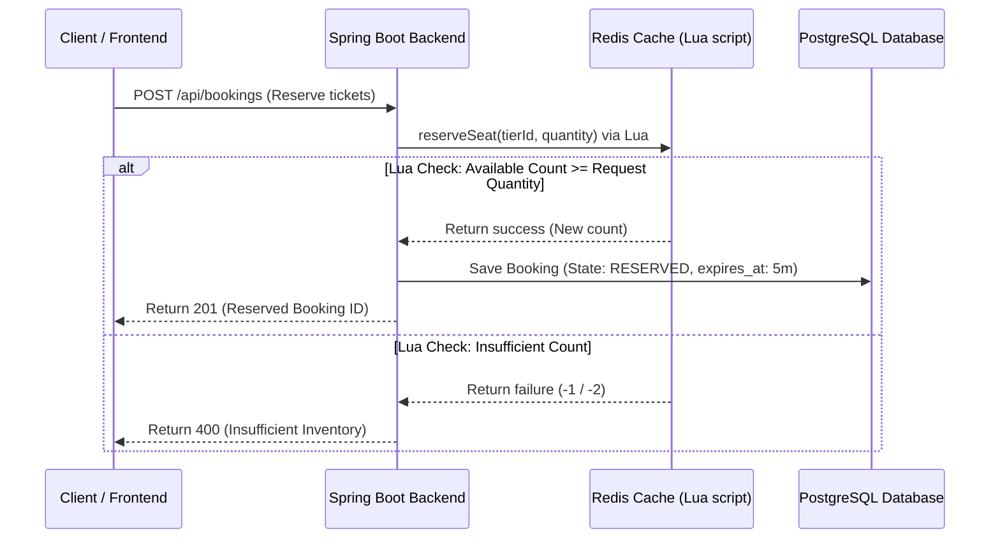

# 🎫 Eventora — High-Concurrency Event Ticketing System

A production-grade, distributed event ticketing platform engineered for high concurrency, ultra-low latency, and resilient asynchronous message handling. Built on a modern reactive-caching architecture to prevent overselling while maintaining high throughput.


---

## 🏗️ Architectural Foundations

TicketCraft is designed with a focus on strict system limits, reliability under spike load, and modular enterprise design patterns:

- **Atomic Inventory Reservation:** Implements Redis Lua floor guards to guarantee zero overselling under heavy load without blocking database connections.
- **Asynchronous Message Processing:** Leverages RabbitMQ with dead-letter-exchanges (DLQs) to reliably decouple expensive tasks like ticket QR code generation and email notifications.
- **Optimal Data Fetching:** Enforces strict `@EntityGraph` query isolation to completely eliminate JPA N+1 lazy loading performance degradations.
- **Audit-Ready Schema Strategy:** Uses PostgreSQL database-level ENUM types for user roles, soft delete mechanisms for reservation records, and UTC `Instant` timeline tracking.
- **Clean Architecture & DI:** Strictly enforces constructor-only dependency injection, thin controllers returning standardized wrapper schemas, and separate presentation layer DTOs.

---

## 🛠️ Infrastructure & Tech Stack

| Component | Technology | Role |
| :--- | :--- | :--- |
| **Language Runtime** | Java 21 (LTS) | Clean OOP, Pattern Matching, virtual-thread ready |
| **Framework Core** | Spring Boot 3.x / Web / Security | Security filters, transaction handling, dependency injection |
| **Primary Database** | PostgreSQL 17 | Relational persistence, transactional isolation |
| **Database Migration** | Flyway | Versioned, immutable, database-level schema changes |
| **Caching & Lock** | Redis 7 | Distributed state tracking, atomic reservation floor checks |
| **Message Broker** | RabbitMQ 4 | Asynchronous tasks, transaction decoupling |
| **Frontend Client** | Next.js 15 (App Router) | High-performance search, filtering, and booking portal |

---

## 🚀 Quick Start

1. Start all infrastructure components:
   - `docker-compose up -d`
   - **PostgreSQL:** Port 5432
   - **Redis:** Port 6379
   - **RabbitMQ:** Port 5672 (AMQP) / 15672 (Management Dashboard)
   - **pgAdmin:** Port 5050 (Database GUI Browser)
   - **Redis Commander:** Port 8081 (Redis GUI Browser)
   - **Mailhog:** Port 1025 (SMTP Server) / 8025 (Web UI Email Browser)
2. Compile the backend:
   - `./mvnw compile`
3. Run the application locally:
   - `./mvnw spring-boot:run`

---

## 📝 System Design Notes

- Uses Flyway migrations configured in `src/main/resources/db/migration` for schema evolution.
- Enforces `Instant` for all time fields globally to prevent server timezone mismatch.
- Centralizes all system limits and business constraints in [BusinessConstants.java](file:///c:/Users/DELL/Desktop/Event-Ticketing-Platform/src/main/java/com/ticketing/common/util/BusinessConstants.java).

---

## 📊 Performance Optimizations

### N+1 Query Elimination

**Problem:** JPA lazy loading caused N+1 queries on paginated event lists. With 10 events and 3 LAZY associations each (organizer, category, venue), one page request generated **31+ SQL queries**.

**Fix:** `@EntityGraph(attributePaths = {"organizer", "category", "venue"})` applied to all list/search methods in `EventRepository` and `BookingRepository`.

| Scenario | Before Fix | After Fix |
| :--- | :--- | :--- |
| Fetch 10 events | 31 queries | **1 query** |
| Fetch event by ID | 4 queries | **1 query** |
| Search published events | 31 queries | **1 query** |
| Fetch 10 bookings | 21 queries | **1 query** |

> Rule: `FetchType.EAGER` is **never** used. N+1 is always fixed via `@EntityGraph` or `JOIN FETCH`.

---

## Day-by-Day Implementation Progress (Week 1 Completed)

### Day 1: Project Initialization & DB Schema

- Scaffolded Spring Boot application.
- Configured initial Flyway migration scripts (`V1` to `V9`) for tables: `users`, `events`, `categories`, `venues`, `ticket_tiers`, `bookings`, `tickets`, `payments`, `refunds`.
- **Optimization:** Defined explicit PostgreSQL ENUM types for roles, soft delete (`deleted_at`) fields on bookings, and enforced UTC timezone using `Instant` for all date-time properties to prevent timezone mismatch anomalies.

### Day 2: Authentication & Event Domain

- JWT security implementation with custom filters (`JwtFilter`) and authorization configuration (`SecurityConfig`).
- Event domain services, repository, and controller.
- **Rule:** Absolute constructor-only dependency injection and class-level `@Transactional(readOnly = true)` pattern.

### Day 3: Venue, Category, & Event Search

- Implemented full CRUD controllers and services for Category, Venue, and Event.
- Added event search filtering (`EventSearchService`) with pageable queries.
- Secured write operations for Venues/Categories (`@PreAuthorize("hasRole('ADMIN')")`) and Events (`@PreAuthorize("hasRole('ORGANIZER') or hasRole('ADMIN')")`).

### Day 4: Next.js Frontend

- Integrated Next.js 15 client (`frontend/`) with search, filter capability, and event details route `/events/[id]`.
- Wired client to query the backend dynamically based on `NEXT_PUBLIC_API_URL`.

### Day 5: High-Concurrency Inventory & Async Messaging

- **Lua Floor Guard:** Avoided overselling by implementing a Redis Lua script floor guard (`reserveSeat()`) guaranteeing atomic decrements only when seats are available.
- **Warm-up Readiness:** Added `InventoryWarmupHealthIndicator` to block Kubernetes/Railway health checks until inventory is successfully populated in Redis cache from database on startup.
- **RabbitMQ Config:** Set up dead-letter-exchanges (DLQs), and async QR code generation task flow offloaded to `ticket.generation.queue`.

### Day 6: N+1 Query Fixes & E2E Testing

- Optimized JPA queries via `@EntityGraph` (reducing SQL queries for 10 events/bookings from 31+ to exactly 1).
- Set up integration testing suite with Docker Testcontainers (PostgreSQL & Redis).
- Created k6 performance baseline testing scripts.

### Day 7: Week 1 Polish & Production Readiness

- Standardized logging using MDC correlation ID propagation across all filters and services (`X-Correlation-ID`).
- Docker Compose improvements: Added container healthchecks to PostgreSQL, Redis, and RabbitMQ to block the application startup until they are ready (`service_healthy`).
- Centralized error response patterns in `GlobalExceptionHandler` mapping entities to descriptive client payloads.

---

## Core System Architecture & Guidelines

### 1. High Concurrency Ticket Reservation Flow



### 2. Mandatory Coding Conventions

- **No Field Injection:** Constructor injection only using `@RequiredArgsConstructor` on all service and controller components.
- **Timezones:** Use `java.time.Instant` for all timestamp database columns and JPA fields. `LocalDateTime` is strictly prohibited.
- **Read-Only Transactions:** Enforce `@Transactional(readOnly = true)` at the class level on services. Mutating database operations must override this with a local `@Transactional`.
- **Security:** Write operations must explicitly check user roles with `@PreAuthorize` method annotations. Web tests must inherit `TestSecurityConfig`.
- **No Magic Numbers:** All constants must be registered in [BusinessConstants.java](file:///c:/Users/DELL/Desktop/Event-Ticketing-Platform/src/main/java/com/ticketing/common/util/BusinessConstants.java).

---

## Full-Stack Local Execution

### Backend

Run unit and mock security tests:

```bash
./mvnw test
```

Start the local server (Ensure Docker Desktop is active if running Testcontainers):

```bash
./mvnw spring-boot:run
```

### Frontend

Configure the environment variables in `frontend/.env.local`:

```env
NEXT_PUBLIC_API_URL=http://localhost:8080
```

Install dependencies and start development server:

```bash
cd frontend
npm install
npm run dev
```
